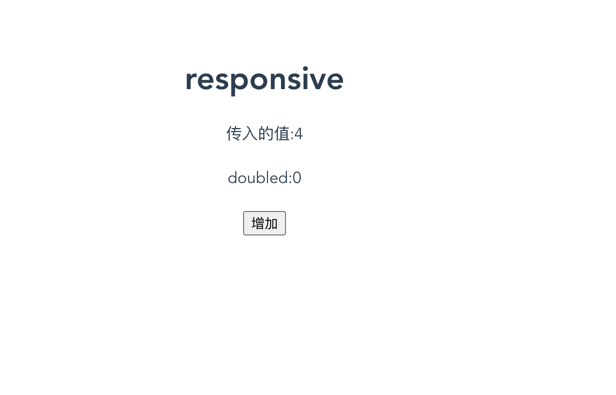
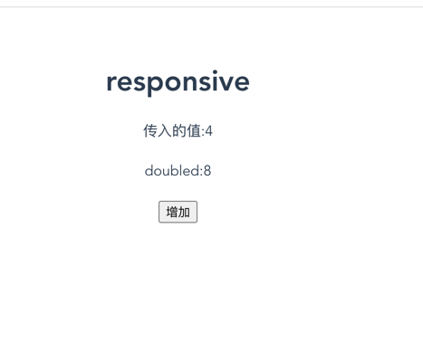
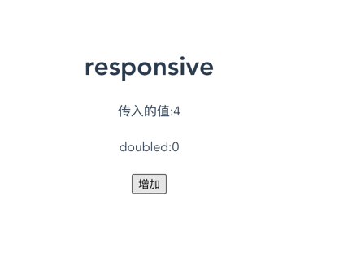
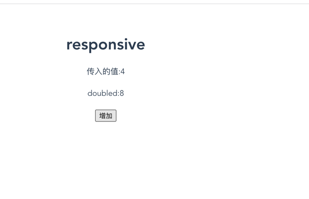
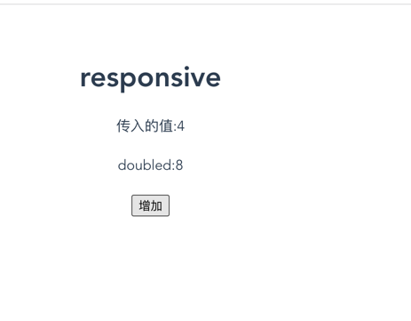

## 1、响应式本质
把数据和函数相关联起来，当数据变化时，函数自动执行。当然这对于函数和数据也是有要求的<br>
函数必须是以下几种:<br> 
    render <br> 
    computed<br>
    watch<br>
    watchEffect<br>
数据必须是以下几种：<br>
   响应式数据<br>
   在函数中用到的数据<br>

## 2、例子
### 2.1
```javascript
<template>
  <div class="responsive">
    <h1>responsive</h1>
    <div>传入的值:{{ count }}</div>
    <br>
    <div>doubled:{{doubleCount}}</div>
    <br>
  </div>
</template>

<script setup>
import { ref, computed } from 'vue'
const props = defineProps({
  count: {
    type: Number,
    default: 0
  }
})
const doubleCount =ref(props.count * 2)
</script>

<style scoped>

</style>
```
结果：    

    

当我们点击增加按钮时，页面并没有发生变化，这是因为我们的doubleCount并没有响应式。    

原因：const doubleCount =ref(props.count * 2)这一过程不涉及到任何函数，数据和数据之间是无法形成关联的，所以doubleCount并不是响应式的。

### 2.2
```javascript   
<template>
  <div class="responsive">
    <h1>responsive</h1>
    <div>传入的值:{{ count }}</div>
    <br>
    <div>doubled:{{doubleCount}}</div>
    <br>
  </div>
</template>

<script setup>
import { ref, computed ,watchEffect} from 'vue'
const props = defineProps({
  count: {
    type: Number,
    default: 0
  }
})
const doubleCount =ref(0)
watchEffect(() => {
  console.log('watchEffect')
  doubleCount.value = props.count * 2
})
</script>

<style scoped>

</style>
```
结果:    

    

当我们点击增加按钮时，页面发生了变化，这是因为我们的doubleCount是响应式的。    

原因:    
函数与数据关联起来了；    

1、watchEffect是一个函数，props.count是一个响应式数据，且在watchEffect中用到了，所以props.count变化了，watchEffect就会执行，导致doubleCount变化；    
2、doubleCount也是个响应式数据，在render函数中用到了，所以doubleCount变化了，render函数就会执行，更新页面。

### 2.3
```javascript
<template>
  <div class="responsive">
    <h1>responsive</h1>
    <div>传入的值:{{ count }}</div>
    <br>
    <div>doubled:{{doubleCount}}</div>
    <br>
  </div>
</template>

<script setup>
import { ref, computed ,watchEffect} from 'vue'
const props = defineProps({
  count: {
    type: Number,
    default: 0
  }
})
function useDouble(count) {
  const doubleCount =ref(0)
  watchEffect(() => {
    console.log('watchEffect')
    doubleCount.value = count * 2
  })
  return doubleCount
}
const doubleCount = useDouble(props.count)

</script>

<style scoped>

</style>
```
结果:    

    

当我们点击增加按钮时，页面未发生变化。    

原因:    
useDouble函数传的参数是一个原始值，没有读到任何响应式数据。所以doubleCount不会更新，从而render函数也不会执行。

### 2.4
```javascript   
<template>
  <div class="responsive">
    <h1>responsive</h1>
    <div>传入的值:{{ count }}</div>
    <br>
    <div>doubled:{{doubleCount}}</div>
    <br>
  </div>
</template>

<script setup>
import { ref, computed ,watchEffect} from 'vue'
const props = defineProps({
  count: {
    type: Number,
    default: 0
  }
})
const doubleCount = computed(() => {
  console.log('computed')
  return props.count * 2
})

</script>

<style scoped>

</style>
```
结果:    


当我们点击增加按钮时，页面发生了变化。    

原因:

1、computed是一个函数，props.count是一个响应式数据，且在computed中用到了，所以props.count变化了，computed就会执行，导致doubleCount变化；    
2、doubleCount也是个响应式数据，在render函数中用到了，所以doubleCount变化了，render函数就会执行，更新页面。

### 2.5
```javascript
<template>
  <div class="responsive">
    <h1>responsive</h1>
    <div>传入的值:{{ count }}</div>
    <br>
    <div>doubled:{{doubleCount}}</div>
    <br>
  </div>
</template>

<script setup>
import { ref, computed ,watchEffect} from 'vue'
const props = defineProps({
  count: {
    type: Number,
    default: 0
  }
})
function useDouble(props) {
  const doubleCount =ref(0)
  watchEffect(() => {
    console.log('watchEffect')
    doubleCount.value = props.count * 2
  })
  return doubleCount
}
const doubleCount = useDouble(props)

</script>

<style scoped>

</style>
```
结果:    
    

当我们点击增加按钮时，页面发生变化。
原因:    
1、props是一个响应式数据，跟watchEffect关联起来了，所以当props.count变化时，watchEffect就会执行，导致doubleCount变化；   
2、doubleCount也是个响应式数据，在render函数中用到了，所以doubleCount变化了，render函数就会执行，更新页面。

tips:VueUse库中的基本都是传的props。


